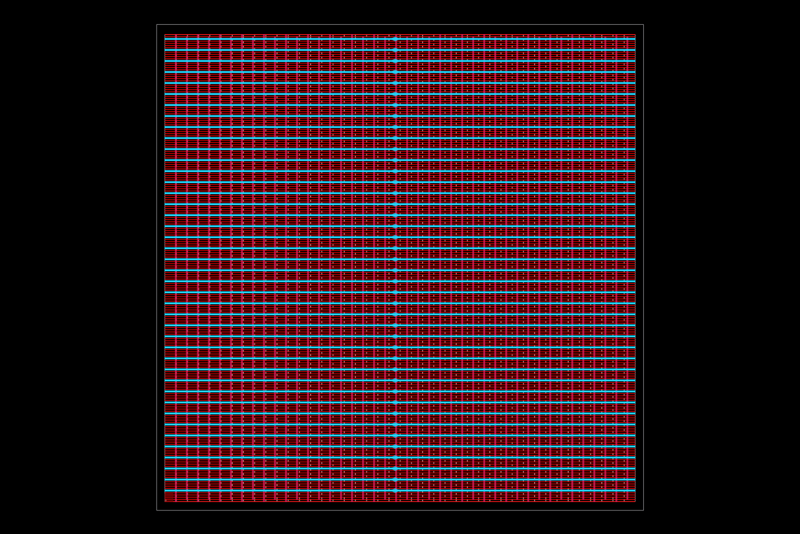
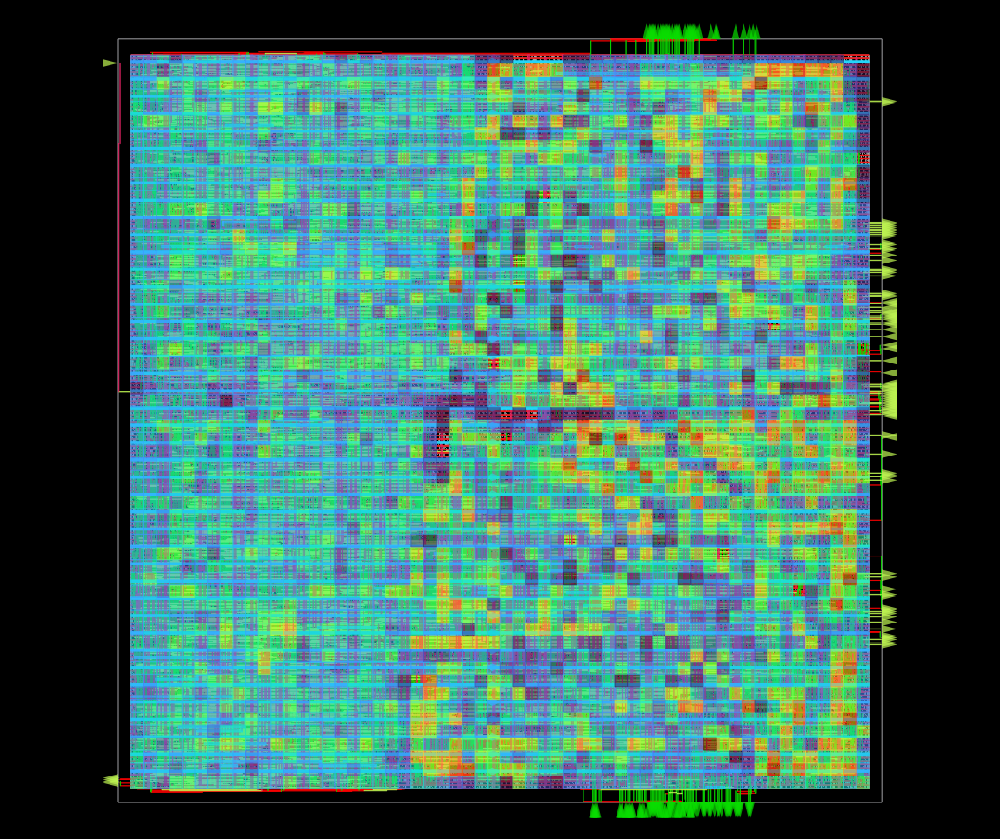
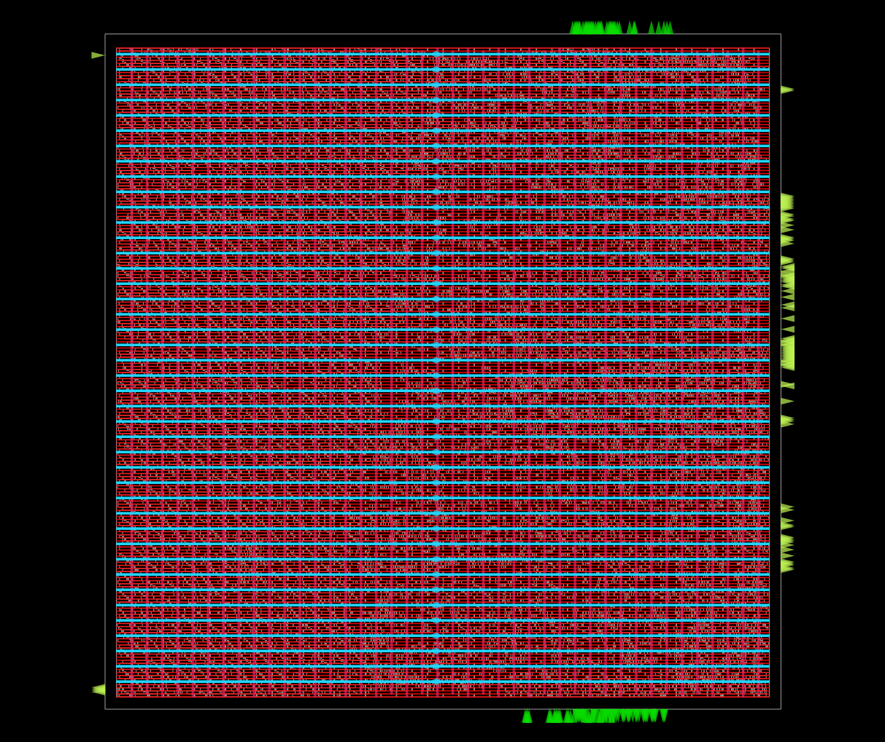
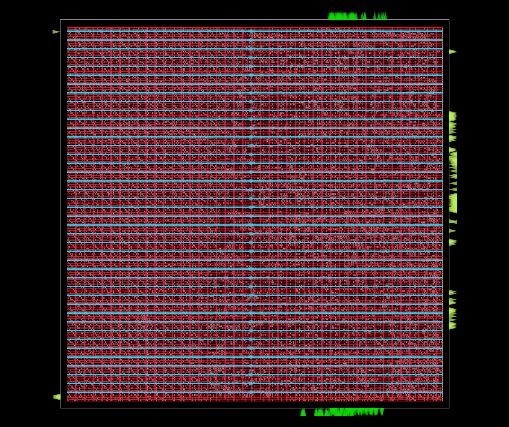
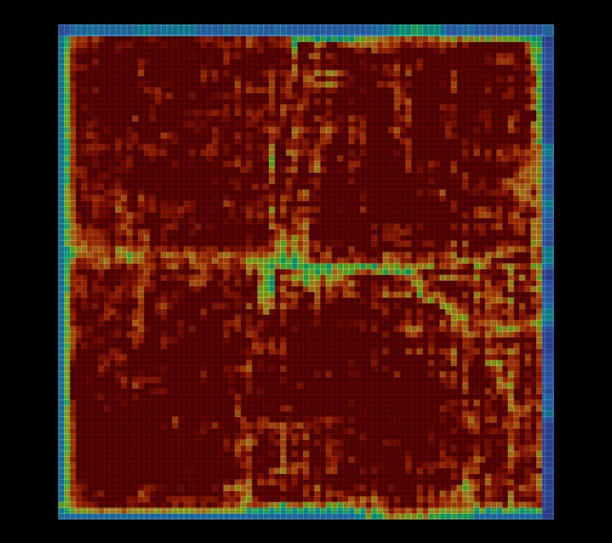
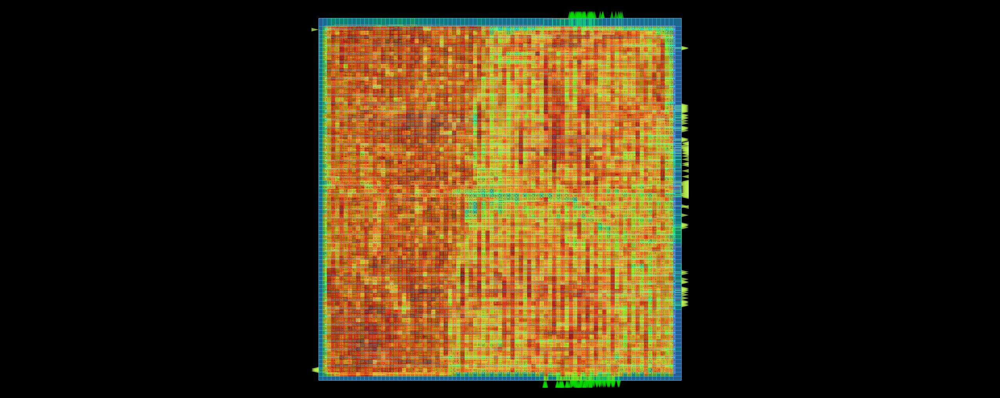
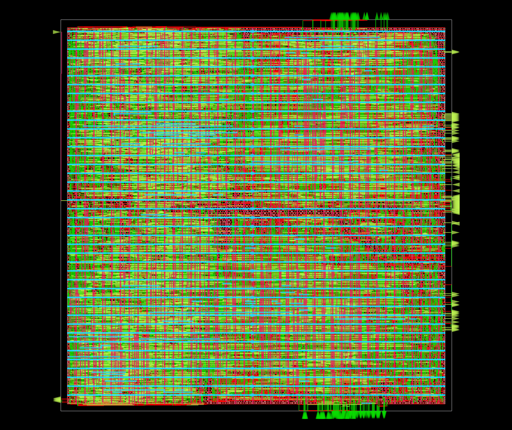
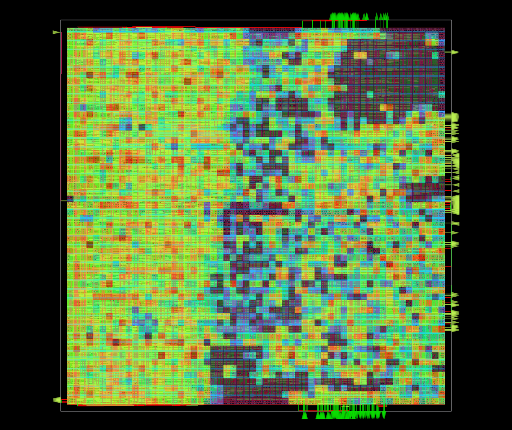
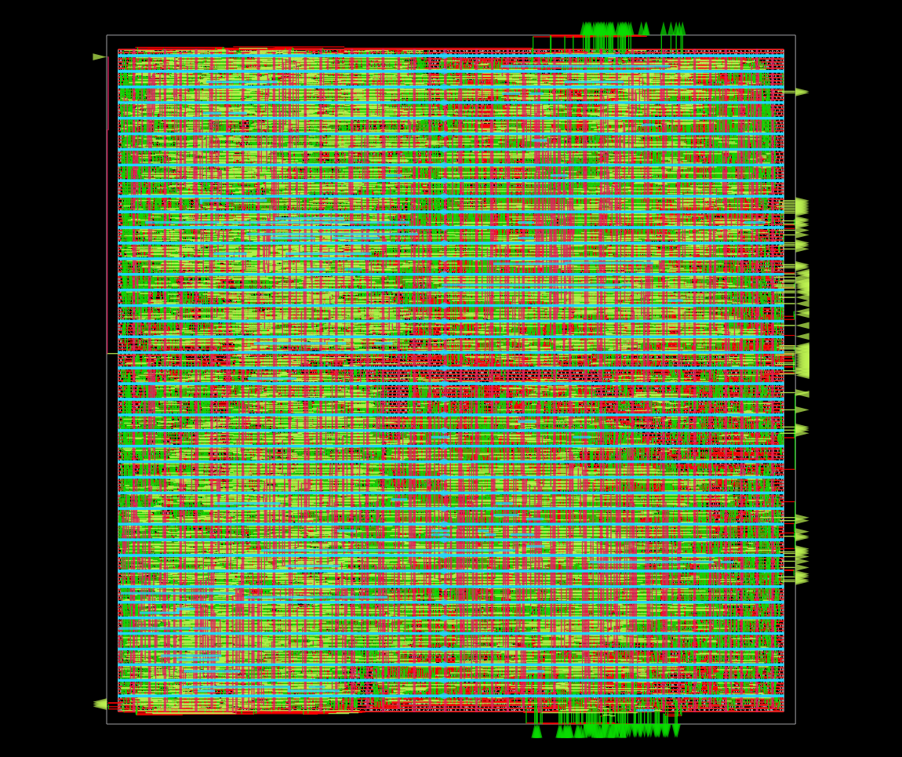

# RISC-V-MultiCore-PPA-Optimization
# Dual-Core RISC-V SoC: 200MHz Physical Design on Sky130

> I designed a high-performance **Dual-Core RISC-V SoC** using the **Sky130hd** process node, successfully achieving **200MHz** timing closure. Throughout the project, I managed complex physical design trade-offs, pivoting from an initial routing failure to an optimized **0.36mm²** die area that achieves a clean GDSII with zero DRC violations. My design is verified for power integrity with a **0.02% IR drop**, demonstrating comprehensive mastery of the RTL-to-GDSII flow and silicon sign-off requirements.

---

## 📊 Key PPA Sign-off Metrics

| Metric | Sign-off Value |
| :--- | :--- |
| **Target Frequency** | 200 MHz (5ns period) |
| **Total Power** | 67.5 mW |
| **Worst-case IR Drop** | **0.02%** (3.80 x 10⁻⁴ V) |
| **Die Area** | 0.36 mm² (600um x 600um) |
| **Active Utilization** | **57%** (Optimized for routing) |
| **Total Instance Count** | 43,828 (Including 25,838 fill cells) |

---

## 🚀 The Physical Design Journey

This project was a rigorous exercise in **Design Space Exploration (DSE)**. I executed multiple iterations to find the optimal balance between silicon real estate and high-frequency performance.

### Phase 1: The "High-Density" Failure
I initially attempted to implement the dual-core design in a $500\text{um} \times 500\text{um}$ area to minimize costs.
*   **The Issue**: Utilization reached **81%**, which proved too dense for the Sky130 Met1 layer. This resulted in **140% metal congestion** and over **39,000 routing overflows**.
*   **The Pivot**: I identified that the dual-core bus architecture required more "routing room" to resolve metal layer conflicts. I successfully pivoted to a $600\text{um}$ floorplan to ensure DRC-clean routing.

### Phase 2: Frequency Scaling & Timing Closure
With a stable floorplan, I pushed the design from a 100MHz baseline to a **200MHz** stress test.
*   **Clock Tree Synthesis (CTS)**: I built a robust H-Tree with 7 levels of depth to manage **3,185 sequential sinks** while minimizing skew.
*   **Timing Result**: I achieved timing closure with a final worst slack of **+0.089ns** after global routing and parasitic extraction.

---

## 🛠️ Technical Challenges & Solutions

### 1. The "Frequency Wall" (Pipeline Analysis)
During the 200MHz run, I identified that the combinational logic path delay for the PicoRV32 on Sky130 was approximately **4.82ns**.
*   **The Constraint**: I determined that pushing for 250MHz (4ns) would be physically impossible without an architectural change.
*   **The Engineering Insight**: I documented this as the **Architecture Limit**, noting that higher frequencies would require increasing **Pipeline Depth** to break up long combinational paths.

### 2. Power Optimization & Clock Gating
At high frequencies, the clock network consumed **40.6%** of total power (27.4mW).
*   **Improvement**: I implemented **Integrated Clock Gating (ICG)** using `dlclk` cells from the Sky130 library. This architectural choice ensures that idle registers do not toggle unnecessarily, preserving the 67.5mW total power budget.

### 3. IR Drop & Voltage Integrity
High-speed switching in dual cores can lead to localized voltage sag.
*   **Solution**: I designed a robust Power Distribution Network (PDN) verified by IR drop analysis. The result was a negligible **0.02% IR drop**, ensuring 1.8V stability across the entire die.

---

## ✅ Physical Verification (DRC/LVS)

I performed a complete sign-off verification to ensure the design is fabrication-ready.

### Design Rule Check (DRC)
I concluded the detailed routing stage with **zero DRC violations**. This confirms the layout adheres to all Sky130hd foundry constraints, including minimum metal width, spacing, and via enclosure rules.
*   **Report**: `reports/sky130hd/soc_top/base/5_route_drc.rpt`

### Layout vs. Schematic (LVS) & Stream-out
I utilized KLayout to merge the physical layout and verify cell matching.
*   **Cell Matching**: Successfully matched all LEF cells to their corresponding GDS library cells.
*   **Clean Merge**: Confirmed **zero orphan cells** during the final GDSII stream-out.

---

## 📦 Toolstack & Methodology
*   **Synthesis:** Yosys
*   **Static Timing Analysis (STA):** OpenSTA
*   **Place & Route:** OpenROAD
*   **GDSII Viewer/Merger:** KLayout
*   **Flow Management:** OpenROAD-flow-scripts (ORFS)

---

## 🖼️ Visualizations

| Floorplan | Pin Density |
|:--------:|:--------:|
|  |  |
| **Place** | **Placement Density** |
|  |  |
| **CTS** | **Estimated Congestion** |
|  |  |
| **Route** | **Routing Congestion** |
|  |  |
| **Final GDSII Layout** | **Power Density** |
|  |  |
| **IR Drop (VDD)** | **IR Drop (VSS)** |
|  |  |

---

## 💻 How to Reproduce

To reproduce this 200MHz dual-core design, follow these steps using the **OpenROAD-flow-scripts (ORFS)**:

1. **Clone the repository**:
   ```bash
   git clone [https://github.com/yourusername/Dual-Core-RISCV-SoC-Sky130.git](https://github.com/yourusername/Dual-Core-RISCV-SoC-Sky130.git)
   cd Dual-Core-RISCV-SoC-Sky130/flow

---

## 📜 License
This project is licensed under the BSD-3 License.
